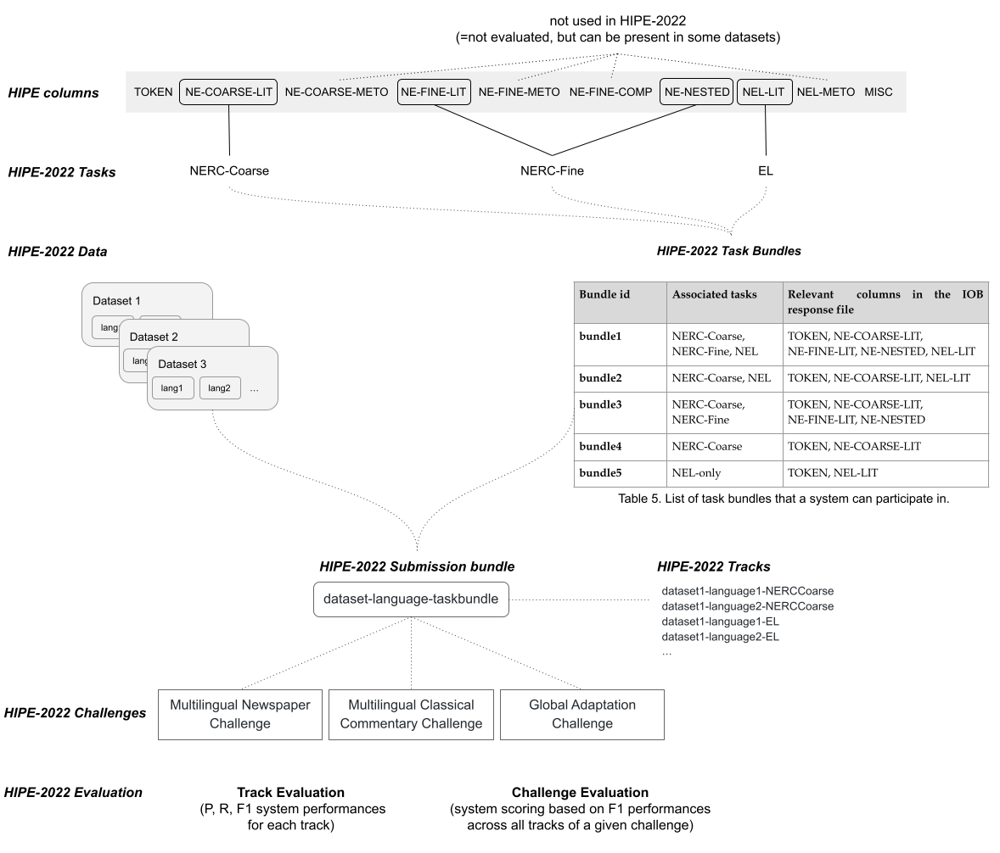
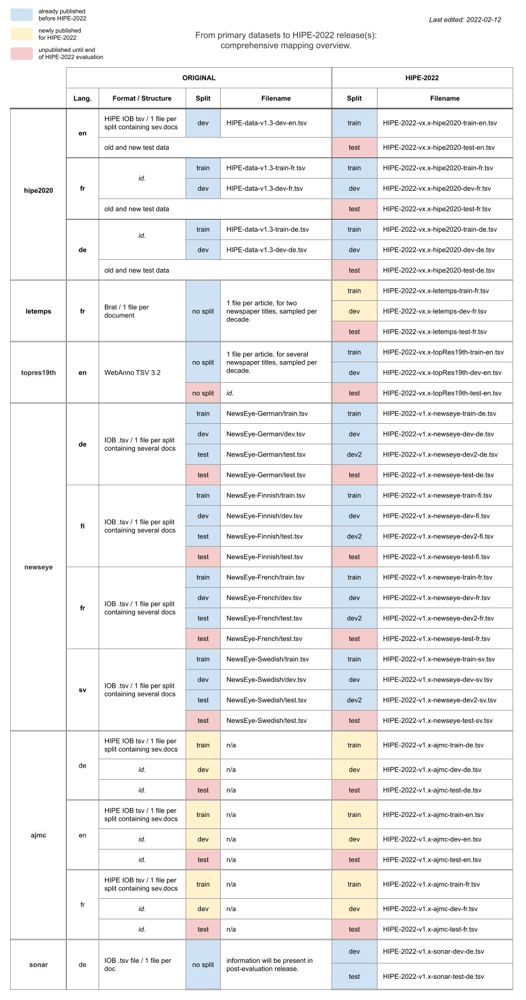

# HIPE-2022-data

[HIPE 2022 shared task](https://hipe-eval.github.io/HIPE-2022/) is a [CLEF 2022 Evaluation Lab](https://clef2022.clef-initiative.eu/) on **named entity recognition and classification (NERC) and entity linking (EL) in multilingual historical documents**.     

Following the first [CLEF-HIPE-2020](https://impresso.github.io/CLEF-HIPE-2020) evaluation lab on historical newspapers in three languages, HIPE-2022 is based on diverse datasets and aims at confronting systems with the challenges of **dealing with more languages, learning domain-specific entities, and adapting to diverse annotation tag sets**. The objective is to gain new insights into the _transferability_ of named entity processing approaches across languages, time periods, document types, and annotation tag sets.

For more information on the shared task, please refer to:    
- :computer: the [website](https://hipe-eval.github.io/HIPE-2022/) for general information on the shared task and registration;    
- :notebook: the [Participation Guidelines](https://doi.org/10.5281/zenodo.6045662) for detailed information on the tasks, datasets and evaluation settings
[](https://doi.org/10.5281/zenodo.6045662).

Key information:    
- **License**: HIPE-2022 data is released under a [CC BY-NV-SA 4.0 License](https://img.shields.io/badge/License-CC_BY--NC--SA_4.0-lightgrey.svg) [](https://creativecommons.org/licenses/by-nc-sa/4.0/)
- **Where to find the data**: in the [data](https://github.com/hipe-eval/HIPE-2022-data/tree/main/data/) folder; in git [releases](https://github.com/hipe-eval/HIPE-2022-data/releases); on [zenodo](https://doi.org/10.5281/zenodo.6089968) [](https://doi.org/10.5281/zenodo.6089968)
- **Release history**:     
      - 15.02.2022: v1.0
      - 22.03.2022: v2.0

[cc-by-nc-sa]: http://creativecommons.org/licenses/by-nc-sa/4.0/
[cc-by-nc-sa-image]: https://licensebuttons.net/l/by-nc-sa/4.0/88x31.png
[cc-by-nc-sa-shield]: https://img.shields.io/badge/License-CC%20BY--NC--SA%204.0-lightgrey.svg

## Primary datasets

HIPE-2022 datasets are based on six primary datasets composed of historical newspapers and classic commentaries covering ca. 200 years. They feature several languages and different entity tag sets and annotation schemes and originate from several European cultural heritage projects, from HIPE organisers’ previous research project, and from the previous HIPE-2020 campaign. Some are already published, others are released for the first time for HIPE-2022.

| Dataset alias | README | Document type | Languages |  Suitable for | Project | License |
|---------|---------|---------------|-----------| ---------------|---------------| ---------------|
| ajmc       | [link](documentation/README-ajmc.md)  | classical commentaries | de, fr, en | NERC-Coarse, NERC-Fine, EL | [AjMC](https://mromanello.github.io/ajax-multi-commentary/) | [](https://creativecommons.org/licenses/by/4.0/) |
| hipe2020   | [link](documentation/README-hipe2020.md)| historical newspapers | de, fr, en | NERC-Coarse, NERC-Fine, EL | [CLEF-HIPE-2020](https://impresso.github.io/CLEF-HIPE-2020)| [](https://creativecommons.org/licenses/by-nc-sa/4.0/)|
| letemps    | [link](documentation/README-letemps.md) | historical newspapers    | fr | NERC-Coarse, NERC-Fine | LeTemps | [](https://creativecommons.org/licenses/by-nc-sa/4.0/)|
| topres19th | [link](documentation/README-topres19th.md) | historical newspapers | en | NERC-Coarse, EL |[Living with Machines](https://livingwithmachines.ac.uk/) | [](https://creativecommons.org/licenses/by-nc-sa/4.0/)|
| newseye    | [link](documentation/README-newseye.md)|  historical newspapers | de, fi, fr, sv | NERC-Coarse, NERC-Fine, EL |  [NewsEye](https://www.newseye.eu/) |  [](https://creativecommons.org/licenses/by/4.0/)|
| sonar      | [link](documentation/README-sonar.md) | historical newspapers  | de | NERC-Coarse, EL |  [SoNAR](https://sonar.fh-potsdam.de/)  | [](https://creativecommons.org/licenses/by/4.0/)|


## HIPE-2022 releases 

A HIPE-2022 release corresponds to a single package composed of neatly structured and homogeneously formatted primary datasets of diverse origins. Primary datasets undergo the following preparation steps:
- conversion to the HIPE format (with correction of data inconsistencies and metadata consolidation);
- rearrangement or composition of train and dev splits.

### Directory structure, naming conventions and versioning:

HIPE-2022 data directory is organised per HIPE release version, dataset and language, as follows:

```
data
└── vx.x
  └── dataset1
  │   ├── lg1
  │   │   ├── HIPE-2022-vx.x-dataset1-train-lg1.tsv
  │   │   ├── HIPE-2022-vx.x-dataset1-dev-lg1.tsv
  │   └── lg2
  │       ├── HIPE-2022-vx.x-dataset2-train-lg2.tsv
  │       ├── HIPE-2022-vx.x-dataset2-dev-lg2.tsv
  └── dataset2
  │   ├── lg1
  │   │   ├── HIPE-2022-vx.x-dataset2-train-lg1.tsv
  │   │   ├── ...
  └── ...
```

**Files and file naming conventions**

- Training and development datasets consist of UTF-8, tab-separated-values files.
- There is one `.tsv` file per dataset, language and dataset split.
- Files contain information needed for all tasks (NERC-Coarse, NERC-Fine, and entity linking).
- Files are named according to this schema:
  `HIPE-2022-<hipeversion>-<dataset-alias>-<split>-<language>.tsv` where `# split = sample|train|dev|dev2|test|`. For example, the file `HIPE-2022-v1.0-newseye-dev-sv.tsv` contains NE-annotated documents of the Swedish part of the newseye corpus which are meant as development set, in HIPE format and from HIPE-2022 release v1.0. 
     

**Versioning**  

- HIPE-2022 release are versioned with a two-part version number (Major.Minor) which is present in 1) the data directory structure and 2) the filename of each file.     
- Each HIPE-2022 release has an equivalent git repository release, with release notes.    
- The version of a primary dataset is mentioned in its document metadata (see below).    


### HIPE format and tagging scheme

HIPE format is a simple tab-separated column textual format using an [IOB]( https://en.wikipedia.org/wiki/Inside–outside–beginning_(tagging)) tagging scheme (inside-outside-beginning format), in a similar fashion to that of the [CoNLL-U](https://universaldependencies.org/format.html) format. 

**File structure**

Files encode annotations needed for all tasks (NERC-Coarse, NERC-Fine and NEL) and contain the following lines:   

- empty lines, which mark the boundaries between documents;    
- comment lines, which give further information and start with the character `#`;    
- annotated lines, which contain a token followed by tab-separated annotations.    

A file contains all the documents of one dataset/language/split. Documents are separated with empty lines and are preceded with several metadata comment lines. The notion of document varies from one dataset to another, please refer to dataset-specific READMEs.

**Document metadata**

Primary datasets provide different document metadata, with different granularity. This information is kept in HIPE-2022 files in the form of "metadata blocks". HIPE-2022 metadata blocks encode as much information as necessary to ensure that each document is self-contained with respect to HIPE-2022 settings.

Metadata blocks uses name spacing to distinguish between mandatory HIPE-2022 metadata and dataset-specific (optional) metadata:


```
# hipe2022:document_id     = [identifier for the document inside a dataset]
# hipe2022:date            = [original document publication date (YYYY-MM-DD, with YYYY-01-01 if month or date are not available)]
# hipe2022:language        = [iso two-letter language code]
# hipe2022:dataset         = [dataset alias as in file name]
# hipe2022:document_type   = [newspaper or commentary]
# hipe2022:original_source = [path to source file in original dataset release] 
# hipe2022:applicable_columns = [all relevant columns for this dataset (TOKEN NE-COARSE etc.) Non-applicable columns have _ values everywhere] 
# DATASET:doi              = [DOI url of primary dataset release (if available)]   
# DATASET:version          = [version of the primary dataset used in the HIPE-2022 release]   
# DATASET: xxx	           = [any other metadata provided with the dataset]
```

**Columns**

Each annotated line consists of 10 columns:

1. `TOKEN`: the annotated token.
2. `NE-COARSE-LIT`: the coarse type (IOB-type) of the entity mention token, according to the literal sense.
3. `NE-COARSE-METO`: the coarse type (IOB-type) of the entity mention token, according to the metonymic sense.
4. `NE-FINE-LIT`: the fine-grained type (IOB-type.subtype.subtype) of the entity mention token, according to the literal sense.
5. `NE-FINE-METO`: the fine-grained type (IOB-type.subtype.subtype) of the entity mention token, according to the metonymic sense.
6. `NE-FINE-COMP`: the component type of the entity mention token.
7. `NE-NESTED`: the coarse type of the nested entity (if any).
8. `NEL-LIT`: the Wikidata Qid of the literal sense, or `NIL` if an entity cannot be linked. Rows without link annotations have value `_’.
9. `NEL-METO`: the Wikidata Qid of the metonymic sense, or `NIL`.
10. `MISC`: a flag which can take the following values:
    - `NoSpaceAfter`, to indicate the absence of white space after the token.
    - `EndOfLine`, to indicate the end of a layout line.
    - `EndOfSentence`, to indicate the end of a sentence.
    - `Partial-START:END`, to indicate the character on/offsets of mentions that do not cover the full token (esp. for German compounds).

Non-specified values are marked by the underscore character (`_`). 

Since they were created according to different annotation schemes, datasets do not systematically include all columns. Applicable columns for a dataset are specified in each document metadata. When a column does not apply for a specific dataset, all its values are `_`.     


### HIPE-2022 NE annotation types

HIPE-2022 annotation scheme originates from the CLEF-HIPE-2020 shared task and contains detailed named entity annotation types (reflected in the IOB file columns and presented above). All HIPE-2022 primary datasets do not necessarily have all annotation types. 

Datasets and their annotation types:


| NE annotation type | ajmc | hipe2020 | letemps  | topres19th | newseye | sonar |
|---------|---------|---------|---------|---------|---------|---------|
|  NE-COARSE-LIT     | x  | x    |  x | x  | x* |  x |
|  NE-COARSE-METO    | x  | x    |    |    |    |    | 
|  NE-FINE-LIT       | x  | x    |  x |    | x* |    | 
|  NE-FINE-METO      |    | x    |    |    |    |    | 
|  NE-FINE-COMP      |    | x    |    |    |    |    | 
|  NE-NESTED         |  x | x    |  x |    | x  |    | 
|  NEL-LIT           |  x | x    |  x |  x | x* |  x | 
|  NEL-METO          |    | x    |    |    |    |    |

*: For this dataset, this column includes the metonymic sense when present.

Given its wide scope in terms of languages and datasets, **HIPE-2022 tasks only focuses on a selection of NE annotation types** (in contrast to CLEF-HIPE-2020 which focused on fine-grained NE processing).

Overview of HIPE-2022 tasks and their annotation types:


| HIPE-2022 Tasks  | NE annotation types | 
| -------| -------|
| NERC-Coarse | NE-COARSE-LIT |
| NERC-Fine | NE-FINE-LIT, NE-NESTED|
| NEL | NEL-LIT | 

The annotation types `NE-COARSE-METO, NE-FINE-METO, NE-FINE-COMP` are not considered in HIPE-2022 tasks and evaluation scenarios but are left in the IOB files when present with a dataset, for systems to use this information if beneficial.

### Dataset statistics

[](https://mybinder.org/v2/gh/hipe-eval/HIPE-2022-data/HEAD?labpath=hipe2022-datasets-stats.ipynb)

Available via this [jupyter notebook](hipe2022-datasets-stats.ipynb).

## HIPE-2022 Evaluation

To accommodate the different dimensions that characterize the HIPE-2022 Evaluation Lab (tasks, languages, document types, entity tag sets) and foster research on transferability, the evaluation lab is organized around **challenges** and **tracks**. 

An overview of the evaluation settings is given below; refer to the [Participation Guidelines](https://doi.org/10.5281/zenodo.6045662) for more information (entity tagsets, evalaution metrics, etc.).



## Acknowledgements

The HIPE 2022 organizing team expresses her greatest appreciation to the CLEF-2022 Lab Organising Committee for the overall organization, to the members of the HIPE-2022 advisory board, namely Sally Chambers, Frédéric Kaplan and Clemens Neudecker, for their support, and to the partnering projects, namely AJMC, impresso-HIPE-2020, Living with Machines, NewsEye, and SoNAR, for contributing (and hiding) their NE-annotated datasets.

## References

**Datasets**

- M. C. Ardanuy et al., [A Dataset for Toponym Resolution in Nineteenth-Century English Newspapers](http://openhumanitiesdata.metajnl.com/articles/10.5334/johd.56/) J. Open Humanit. Data, vol. 8, Jan. 2022, doi: 10.5334/johd.56. 

- M. Ehrmann, G. Colavizza, Y. Rochat, and F. Kaplan, [Diachronic evaluation of NER systems on old newspapers](https://infoscience.epfl.ch/record/221391) in Proceedings of the 13th Conference on Natural Language Processing (KONVENS 2016), Bochum, 2016, pp. 97–107.

- A. Hamdi et al., [A Multilingual Dataset for Named Entity Recognition, Entity Linking and Stance Detection in Historical Newspapers](https://doi.org/10.1145/3404835.3463255) in Proceedings of the 44th International ACM SIGIR Conference on Research and Development in Information Retrieval, New York, NY, USA, Jul. 2021, pp. 2328–2334. 

- S. Menzel et al., [Named Entity Linking mit Wikidata und GND – Das Potenzial handkuratierter und strukturierter Datenquellen für die semantische Anreicherung von Volltexten](https://www.degruyter.com/document/doi/10.1515/9783110691597-012/html) in Named Entity Linking mit Wikidata und GND – Das Potenzial handkuratierter und strukturierter Datenquellen für die semantische Anreicherung von Volltexten, De Gruyter Saur, 2021, pp. 229–258. doi: 10.1515/9783110691597-012.

- M. Romanello, N.-M. Sven, and R. Bruce, [Optical Character Recognition of 19th Century Classical Commentaries: the Current State of Affairs](https://doi.org/10.1145/3476887.3476911) in The 6th International Workshop on Historical Document Imaging and Processing, New York, NY, USA, Sep. 2021, pp. 1–6. doi: 10.1145/3476887.3476911.

**Previous shared task and survey**

-  M. Ehrmann, A. Hamdi, E. L. Pontes, M. Romanello, and A. Doucet, [Named Entity Recognition and Classification on Historical Documents: A Survey](http://arxiv.org/abs/2109.11406) ArXiv210911406, Sep. 2021. 

- M. Ehrmann, M. Romanello, A. Flückiger, and S. Clematide, [Extended Overview of CLEF HIPE 2020: Named Entity Processing on Historical Newspapers](https://infoscience.epfl.ch/record/281054) in Working Notes of CLEF 2020 - Conference and Labs of the Evaluation Forum, Thessaloniki, Greece, 2020, vol. 2696, p. 38. doi: 10.5281/zenodo.4117566. 

- CLEF-HIPE-2020 Participant Papers in [Working Notes of CLEF 2020 - Conference and Labs of the Evaluation Forum](http://ceur-ws.org/Vol-2696/), edited by Linda Cappellato, Carsten Eickhoff, Nicola Ferro, Aurélie Névéol.

- CLEF-HIPE-2020 Workshop [Presentation Video Recordings](https://www.youtube.com/playlist?list=PLB45F159nVx-3bee7G_1jdTfUAtsLD0FU).


## Appendix: Overview of Mapping of Primary Dataset to HIPE-2022




