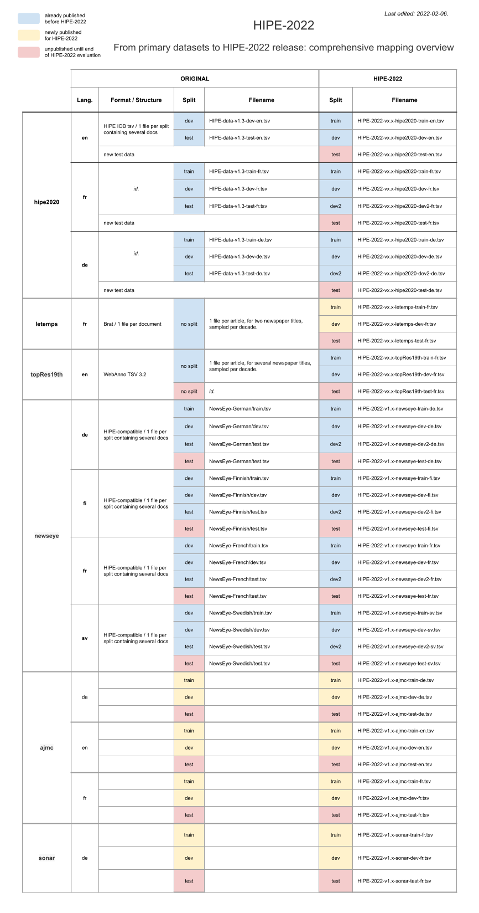

# HIPE-2022-data

[HIPE 2022 shared task](https://hipe-eval.github.io/HIPE-2022/) is a [CLEF 2022 Evaluation Lab](https://clef2022.clef-initiative.eu/) which focuses on the tasks of **named entity recognition and classification (NERC) and entity linking (EL) in multilingual historical documents**. Following the first [CLEF-HIPE-2020](https://impresso.github.io/CLEF-HIPE-2020) evaluation lab on historical newspapers in three languages, HIPE-2022 is based on diverse datasets and aims at confronting systems with the challenges of **dealing with more languages, learning domain-specific entities, and adapting to diverse annotation tag sets**. The main objective is to gain new insights into the _transferability_ of named entity processing approaches across languages, time periods, document types, and annotation tag sets.

Please refer to:
- :computer: the [website](https://hipe-eval.github.io/HIPE-2022/) for general information on the shared task and registration;
- :notebook: the [participation guidelines]() for detailed information on the tasks, datasets and evaluation settings.

## Primary datasets

HIPE-2022 primary datasets are composed of historical newspapers and classic commentaries covering ca. 200 years, feature several languages and different entity tag sets and annotation schemes. They originate from several European cultural heritage projects, from HIPE organisers’ previous research project, and from the previous HIPE-2020 campaign. Some are already published, others are released for the first time for HIPE-2022.

| Dataset alias | README | Document type | Languages |  Suitable for | Project | 
|---------|---------|---------------|-----------| ---------------|---------------|
| ajmc       | [link](doc/README-ajmc.md)  | classical commentaries | de, fr, en | NERC and EL | AjMC |
| hipe2020   | [link](doc/README-hipe2020.md)| historical newspapers | de, fr, en | NERC and EL | [CLEF-HIPE-2020](https://impresso.github.io/CLEF-HIPE-2020)|
| letemps    | [link](doc/README-letemps.md) | historical newspapers    | fr | NERC  | LeTemps |
| topRes19th | [link](doc/README-topres19th.md) | historical newspapers | en | NERC and EL |[Living with Machines](https://livingwithmachines.ac.uk/) |
| newseye    | [link](doc/README-newseye.md)|  historical newspapers | de, fi, fr, sv | NERC and EL |  [NewsEye](https://www.newseye.eu/) | 
| sonar      | [link](doc/README-sonar.md) | historical newspapers  | de | NERC and EL |  [SoNAR](https://sonar.fh-potsdam.de/)  |


## HIPE-2022 releases 

A HIPE-2022 release corresponds to a single package composed of neatly structured and homogeneously formatted datasets of diverse origins. Primary datasets undergo the following preparation steps:
- conversion to the HIPE format (with correction of data inconsistencies and metadata consolidation);
- rearrangement or composition of train and dev splits.

### Directory structure and naming conventions

HIPE-2022 data directory is organised per HIPE release version, dataset and language, as follows:

```
data
└── vx.x
  └── dataset1
  │   ├── lg1
  │   │   ├── HIPE-2022-vx.x-dataset1-train-lg1.tsv
  │   │   ├── HIPE-2022-vx.x-dataset1-dev-lg1.tsv
  │   └── lg2
  │       ├── HIPE-2022-vx.x-dataset2-train-lg2.tsv
  │       ├── HIPE-2022-vx.x-dataset2-dev-lg2.tsv
  └── dataset2
  │   ├── lg1
  │   │   ├── HIPE-2022-vx.x-dataset2-train-lg1.tsv
  │   │   ├── ...
  └── ...
```

**Files and file naming conventions**

- Training and development datasets consist of UTF-8, tab-separated-values files.
- There is one `.tsv` file per dataset, language and dataset split.
- Files contain information needed for all tasks (NERC-Coarse, NERC-Fine, and entity linking).
- Files are named according to this schema:
  `HIPE-2022-<hipeversion>-<dataset-alias>-<split>-<language>.tsv` where `# split = sample|train|dev|dev2|test|`. For example, the file `HIPE-2022-v1.0-newseye-dev-sv.tsv` contains NE-annotated documents of the Swedish part of the newseye corpus which are meant as development set, in HIPE format and from HIPE-2022 release v1.0. 
     

**Versioning**  
- HIPE-2022 release are versioned with a two-part version number (Major.Minor) which is part of 1) the data directory structure and 2) the filename of each file.
- Each HIPE-2022 release has an equivalent git repository release, with release notes.
- The version of each specific dataset is mentioned in document metadata (see below).


### HIPE format and tagging scheme

HIPE format is a simple tab-separated column textual format using an [IOB]( https://en.wikipedia.org/wiki/Inside–outside–beginning_(tagging)) tagging scheme (inside-outside-beginning format), in a similar fashion to that of the [CoNLL-U](https://universaldependencies.org/format.html) format. 

**File contents**

Files encode annotations needed for all tasks (NERC-Coarse, NERC-Fine and entity linking) and contain the following lines:
- empty lines, which mark the boundaries between documents;    
- comment lines, which give further information and start with the character `#`;    
- annotated lines, which contain a token followed by tab-separated annotations.    

A file contains all the documents of one dataset/language/split. Documents are separated with empty lines and are preceded with several comment lines providing document metadata. The notion of document varies from one dataset to another, please refer to dataset-specific READMEs.

**Document metadata**

Primary datasets provide different document metadata, with different granularity. These information are kept in HIPE-2022 files in the form of "metadata blocks" which encodes as many information as necessary to ensure that each document is 'self-contained'.

HIPE-2022 document metadata blocks uses name spacing to distinguish between mandatory HIPE-2022 metadata and dataset-specific (optional) metadata and are as follows:


```
# hipe2022:document_id     = [value: identifier for the document inside a dataset]
# hipe2022:date            = [value: original document publication date (YYYY-MM-DD, with YYYY-01-01 if month or date are not available)]
# hipe2022:language        = [value: iso two-letter language code]
# hipe2022:dataset         = [value: dataset alias as in file name]
# hipe2022:original_source = [value: path to source file in original dataset release] 
# DATASET:doi              = [value: DOI url of primary dataset release (if available)]   
# DATASET:version          = [value: version of primary dataset as indicated in latest release]   
# to be continued....
```


## Licenses
The primary datasets which compose HIPE-2022 data are released under different licenses, please refer to each dataset specific README.


## Additional resources


## Primary datasets to 2HIPE-2022: mapping comprehensive overview




## Acknowledgements


